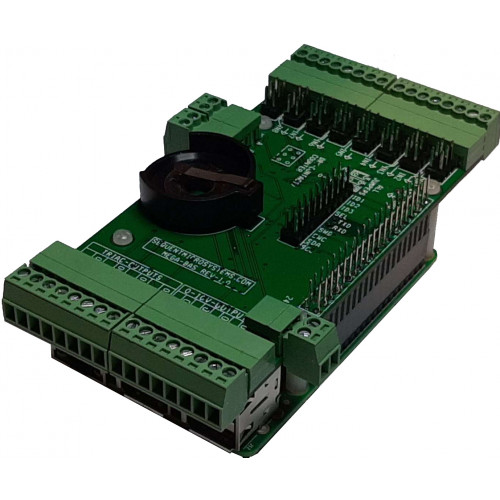

[](https://www.sequentmicrosystems.com)

# megabas-rpi

This is the command to control [Building Automation Stackable Card for Raspberry Pi](https://sequentmicrosystems.com/products/building-automation-8-layer-stackable-hat-v4-for-raspberry-pi)



## Setup

Don't forget to enable I2C communication:
```bash
~$ sudo raspi-config
```

## Usage

```bash
~$ git clone https://github.com/SequentMicrosystems/megabas-rpi.git
~$ cd megabas-rpi/
~/megabas-rpi$ sudo make install
```

Now you can access all the functions of the BAS board through the command "megabas". Use -h option for help:
```bash
~$ megabas -h
```
 ## Update
If you clone the repository, any update can be made with the following commands:

```bash
~$ cd megabas-rpi/  
~/megabas-rpi$ git pull
~/megabas-rpi$ sudo make install
```
## Software selectable input type

For cards version 5.0 and up, input types are not dipswitch selectable, as for the previous versions, but software selectable. 
The default setting of the Inputs type is 0-10V, to change it:

 1) Make sure you have the latest ```megabas``` command installed, as explained above.
 2) Run the command ```megabas <stack> incfgwr <channel> <value>```, where
      * stack = 0 - 7, Stack level selectable from ID0, ID1, ID2 dipswitches
      * channel = 1 - 8, Channel number you need to modify
      * value = 0 for 0-10V, 1 for 1K Thermistor or Dry contact, 2 for 10K Thermistor

For more info on the commands' parameters run ```megabas -h incfgwr``` and ```megabas -h incfgrd```.
The input type settings are saved into the card's nonvolatile memory, so will be preserved after power-down.

## Additional Drivers / Resources

[Python Library](python/README.md)

[Firmware update instructions](update/README.md).

[Node-RED](https://github.com/SequentMicrosystems/megabas-rpi/tree/master/node-red-contrib-sm-bas)

[CODESYS Driver](https://github.com/SequentMicrosystems/megabas-rpi/tree/master/CODESYS)

[Home Assistant Integration](https://github.com/SequentMicrosystems/SMmegabas-ha)

[Open PLC](https://openplcproject.com/)

[Arduino Library](https://github.com/SequentMicrosystems/Sequent-Building-Automation-Library)

The board can act as Modbus RTU slave device, checkout [modbus instructions](MODBUS.md)
